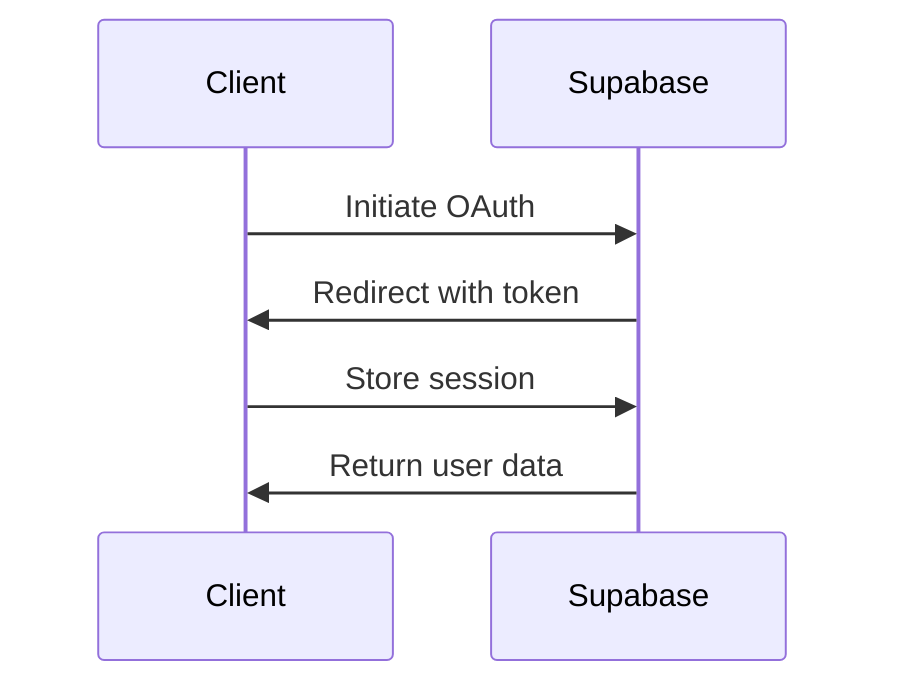

# Technical Design Document

## Project Structure

```
├── src/                # Source code directory
│   ├── ecs/            # Entity Component System architecture
│   │   ├── components/  # Behavior components (Transform, Movement, etc.)
│   │   ├── entities/    # Entity definitions
│   │   │   ├── base/    # Base entity classes
│   │   │   ├── builders/ # Builder pattern implementations
│   │   │   ├── presets/  # Preconfigured entity templates
│   │   │   └── types/    # Type definitions and registries
│   │   └── systems/     # Behavior systems (Input, Physics, etc.)
│   ├── factories/      # Object creation factories
│   ├── sprites/        # Phaser game object implementations
│   └── textures/       # Texture management
├── public/            # Static assets
├── .env              # Environment variables (not in git)
├── .env.example      # Example environment variables
├── .eslintrc.json    # ESLint configuration
├── .prettierrc       # Prettier formatting rules
├── tsconfig.json     # TypeScript configuration
├── vite.config.ts    # Vite build configuration
└── README.md         # Project documentation
```

## Client Architecture (ECS)

### Entity Composition System

Three-layered creation pattern:

1. **Builders** - Fluent interface for complex entities:

```typescript
// ecs/entities/builders/PlayerBuilder.ts
public withMovement(speed: number): PlayerBuilder {
  this.components.push(new MovementComponent(speed));
  return this;
}
```

2. **Presets** - Common entity configurations:

```typescript
// ecs/entities/presets/EnemyPresets.ts
export const BasicEnemyPreset = () =>
  new EnemyBuilder().withHealth(100).withAttack(20).build();
```

3. **Type Registry** - Type-safe component management:

```typescript
// ecs/entities/types/ComponentRegistry.ts
export type ComponentMap = {
  Transform: { x: number; y: number };
  Movement: { speed: number; direction: Vector2 };
  // Additional components get full type checking
};

// Registry validation ensures component compatibility
registerComponent<Movement>({
  name: 'Movement',
  required: ['speed'],
  defaults: { direction: Vector2.UP },
});
```

### Entity Component System Implementation

- Game objects composed via components
- Separation of data (models) and presentation (sprites)
- Systems handle specific behavior domains

### Asset Management

- Centralized asset loading
- Texture atlas generation
- Audio pipeline optimization

### Input Handling

- Unified input abstraction
- Support for keyboard/touch controls
- Input buffering system

## Backend Architecture (Supabase)

### Data Model

```sql
-- See init.sql for full schema details
TABLE users {
  id uuid [pk, ref: > auth.users.id]
  username text [unique]
  created_at timestamptz
}

TABLE games {
  id uuid [pk]
  game_key text [unique, note: 'alphanumeric and underscore only']
  display_name text [note: '1-100 chars']
  created_at timestamptz
}

TABLE game_sessions {
  id uuid [pk]
  game_id uuid [ref: > games.id]
  user_id uuid [ref: > users.id]
  score integer [default: 0]
  metadata jsonb [default: '{}', note: 'game-specific data']
  created_at timestamptz
  updated_at timestamptz
}

Indexes {
  (user_id)
  (game_id)
  (score) [desc]
  (game_id, score) [desc]
  (user_id, game_id)
}

Views {
  high_scores {
    game_key
    user_id
    username
    score
    created_at
  }

  GAME_KEY_high_scores {  # Created per game
    username
    score
    metadata
    created_at
  }
}
```

### Client Integration

Example client usage:

```typescript
// services/supabase/client.ts
import { createClient } from '@supabase/supabase-js';

const supabase = createClient(
  import.meta.env.VITE_SUPABASE_URL,
  import.meta.env.VITE_SUPABASE_ANON_KEY
);

// Example service integration
export const ScoreService = {
  async submitScore(score: number, metadata: object) {
    const { data, error } = await supabase
      .from('game_sessions')
      .insert({
        score,
        metadata,
        game_id: 'current-game-id',
      })
      .select();

    return { data, error };
  },
};
```

Key features:

- RLS enabled on all tables with policies:

  - Users can only manage their own profiles
  - Anyone can view games
  - Users can view all game sessions
  - Users can only create/update their own sessions

- Automatic timestamps:

  - created_at on all tables
  - updated_at trigger on game_sessions

- Game-specific features:

  - Metadata JSON field for flexible game data
  - Per-game high score views
  - Game registration system

- Performance optimizations:
  - Composite indexes for common queries
  - Cascading deletes for referential integrity
  - Efficient high score views

Example usage:

```typescript
// Record a game session
await supabase.from('game_sessions').insert({
  game_id: gameId,
  user_id: userId,
  score: 1000,
  metadata: {
    level: 5,
    items_collected: 10,
    time_played: 120,
  },
});

// Get game-specific high scores
await supabase
  .from('pacman_high_scores')
  .select('username, score, metadata')
  .order('score', { ascending: false })
  .limit(10);
```

## Client-Backend Communication

### Authentication Flow



### Score Submission Process

1. Game completes ECS entity state serialization
2. Client validates score through ECS services
3. ScoreService packages data for Supabase API
4. Supabase RLS policies verify request
5. Transaction recorded in game_sessions table

### Real-time Updates

```typescript
// services/supabase/realtime.ts
const channel = supabase
  .channel('leaderboard')
  .on(
    'postgres_changes',
    {
      event: 'INSERT',
      schema: 'public',
      table: 'game_sessions',
    },
    payload => {
      // Update ECS entities with new scores
      ScoreSystem.handleNewScore(payload.new);
    }
  )
  .subscribe();
```

## Performance Considerations

- Object pooling for frequent creations/destructions
- Spatial partitioning for collision detection
- Batch rendering where applicable
